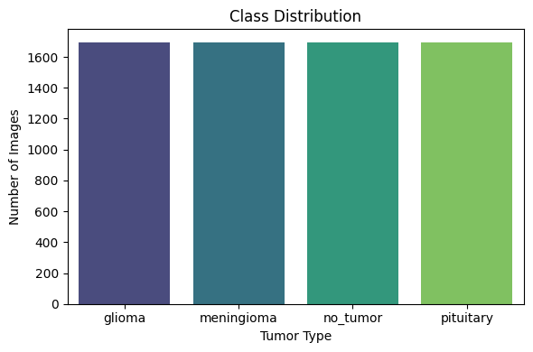
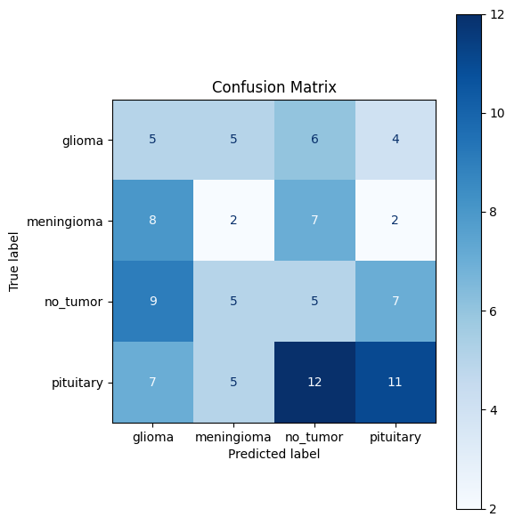
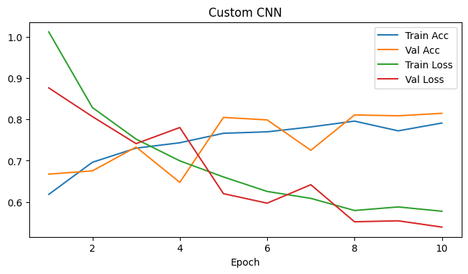
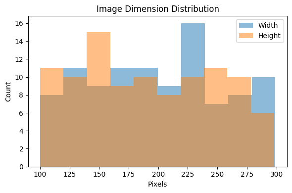
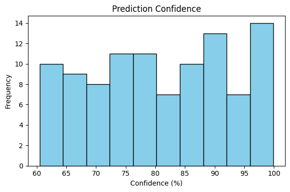
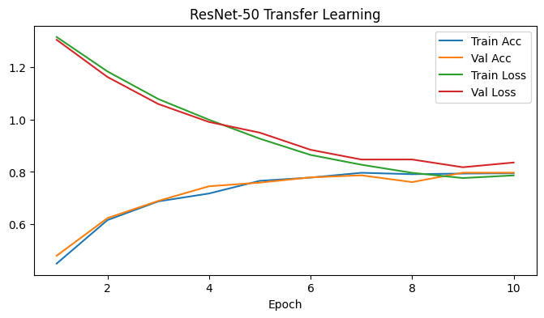

#🧠 MRI Brain Tumor Classification*

This project leverages deep learning techniques to automatically classify brain tumors from MRI scans. Built with PyTorch for model development and Streamlit for an interactive user interface, it enables users to upload MRI images and receive instant predictions about tumor type. The system supports both a custom Convolutional Neural Network (CNN) and a transfer learning approach using ResNet50, providing robust and accurate classification across four categories: Glioma, Meningioma, Pituitary Tumor, and No Tumor. The application also features visual feedback, confidence scores, and text-to-speech prediction summaries, making it accessible for both clinical and educational use.

### Tumor Categories:
- **Glioma**
- **Meningioma**
- **Pituitary Tumor**
- **No Tumor**

---

## 🚀 Features

- Upload multiple MRI images via drag & drop
- Interactive and colorful Streamlit UI
- PyTorch-based CNN and Transfer Learning (ResNet50)
- Text-to-speech prediction feedback using `gTTS`
- Confidence boosting using RGB pixel range
- Visual summaries via charts

---

## 🧠 Model Variants

- 🧩 `cnn_model.pt`: Custom CNN model built from scratch
- 🏗️ `transfer_model.pt`: Transfer learning model (ResNet50)

---

## 📁 Files

- `streamlit_app.py`: Main Streamlit application
- `requirements.txt`: Python dependencies
- `LICENSE`: Project license
- `brain_tumor_classification_clean.ipynb`: Jupyter notebook for model training
- `training_history.json`: Logs of training history

---

## 📊 Charts

- `Class_Distribution.png`: Bar chart of class distribution
- `Confusion_Matrix.png`: Confusion matrix heatmap
- `Custom_CNN.png`: Architecture diagram of custom CNN
- `Image_Dimension.png`: Distribution of image dimensions
- `Prediction_Confidence.png`: Histogram of prediction confidence scores
- `ResNet50_Transfer.png`: Architecture diagram of ResNet50

---

## 📁 Project Structure

```plaintext

MRI_classifier/
├── app/
│ └── streamlit_app.py # Streamlit frontend
├── charts/
│ ├── Class_Distribution.png
│ ├── Confusion_Matrix.png
│ ├── Custom_CNN.png
│ ├── Image_Dimension.png
│ ├── Prediction_Confidence.png
│ └── ResNet50_Transfer.png
├── data/
│ ├── train/
│ ├── test/
│ └── valid/ # MRI datasets
├── models/
│ ├── cnn_model.pt
│ └── transfer_model.pt # Saved model weights
├── brain_tumor_classification_clean.ipynb # Jupyter notebook (model training)
├── cnn_model.pth # Model for deployment (root copy)
├── tl_model.pth # TL model for deployment (root copy)
├── training_history.json # Training logs
├── requirements.txt # Python dependencies
└── LICENSE # MIT License
```

---

## 📦 Requirements
```plaintext
Python 3.10+
streamlit
torch
torchvision
gtts
numpy
matplotlib
seaborn
scikit-learn
```

## 🔗 Links
- [Gdrive link to dataset and models](https://drive.google.com/drive/u/0/folders/1pstzDB3J1z1pA6zTq4Rffc6buhC5LyAX)
- [Streamlit app](https://mri-classifier-2rpnrca7zgssskbuidfibp.streamlit.app/)

---

## 📜 License

```plaintext
MIT License
```

---

## 📈 Visualizations

### 🔹 Class Distribution


### 🔹 Confusion Matrix


### 🔹 Custom CNN Architecture


### 🔹 MRI Image Dimension Distribution


### 🔹 Prediction Confidence


### 🔹 ResNet50 Architecture


---

## 📢 Acknowledgments
This project is inspired by the need for efficient and accurate brain tumor classification using deep learning techniques. Special thanks to the PyTorch and Streamlit communities for their invaluable resources and support.

---

## ⚙️ Installation

```bash
git clone <repository-url>
cd <repository-directory>
pip install -r requirements.txt
```

---

## 🤝 Contributing
Contributions are welcome! Please open an issue or submit a pull request for any improvements or bug fixes.
